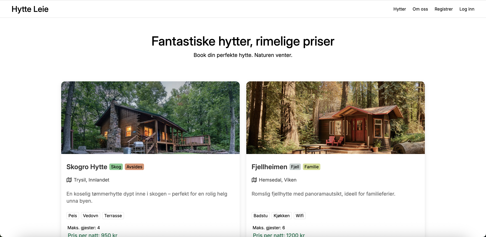
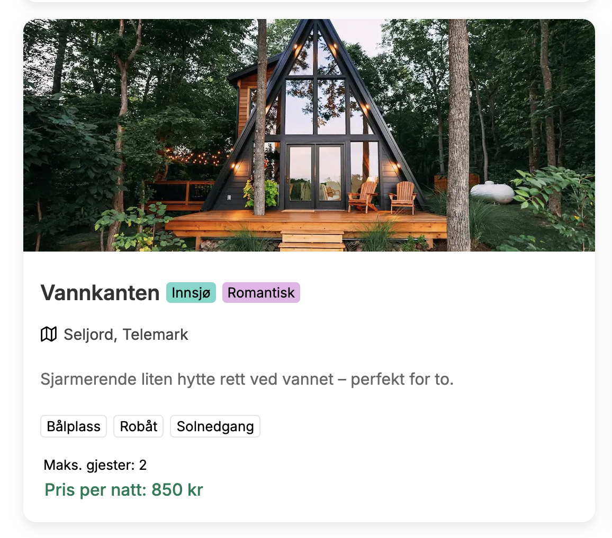

# 🏡 Hytte Leie

**Hytte Leie** er en moderne webapp laget av <a href="https://wesseldalen.eu">Wessel van Dalen</a> med **React** og **TypeScript**, hvor brukere kan opprette konto, utforske idylliske hytter i norsk natur – og enkelt bestille seg et rolig avbrekk.

---

## 🚀 Funksjoner

- 🔐 Registrering og innlogging
- 🔎 Bla gjennom tilgjengelige hytter
- 🏕️ Detaljert visning av hver hytte
- 📅 Bestill og reserver ønsket periode

---

## 🧑‍💻 Teknologier brukt

- **React** + **TypeScript**
- **HTML / CSS**
- **Firebase** som authentication platform
- **Firestore** for å lagre ting i noSQL databasen

*** 

 
Lurer du på noe? Send meg en e-post på <a href="mailto:wesselvandalen@gmail.com">wesselvandalen@gmail.com</a>

